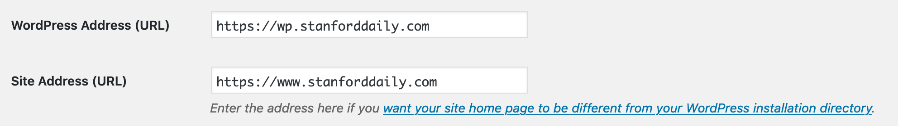
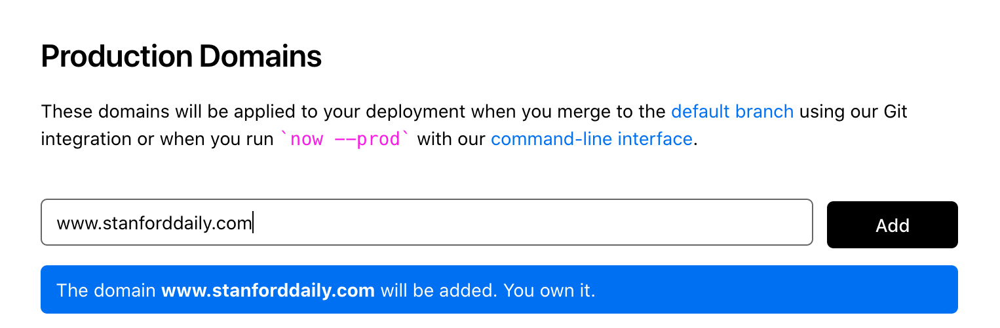
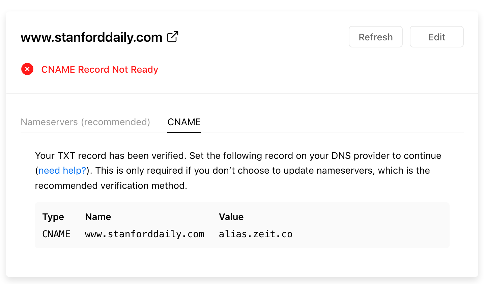

# Deployment

This document was written on 2019-11-02 by Yifei He.

To deploy the project, you would need a [ZEIT Now.sh](https://zeit.co/) project ready. You will also need to install [`tsd-headless`](https://github.com/TheStanfordDaily/stanforddaily-wordpress/tree/master/wp-content/themes/tsd-headless) WordPress theme and [`tsd-json`](https://github.com/TheStanfordDaily/stanforddaily-wordpress/tree/master/wp-content/plugins/tsd-json) WordPress plugin. You should have already activated `tsd-json` plugin.

1. Move your WordPress site to a new domain such as `wp.yourdomain.com`. In wp-admin's "General Settings", set "WordPress Address (URL)" to `https://wp.yourdomain.com`. You should keep "Site Address (URL)" the same (that's the URL you want your visitor to see).

2. Add your website domain in now.sh's admin panel.

3. Set up the domain's CNAME record accordingly.

4. Wait until you can visit the project on the new website at the main domain.

5. Activate `tsd-headless` theme.
